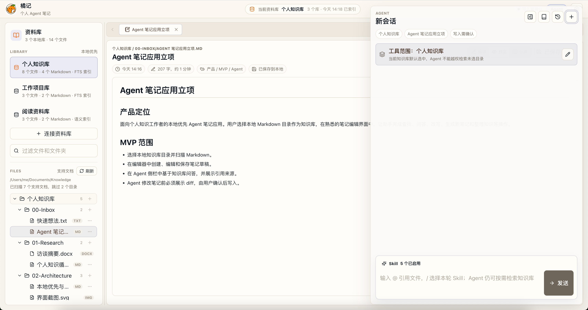

# 橘记（Orange）



橘记是一款面向个人知识工作的本地优先 Agent 笔记应用。它将用户选择的本地目录作为知识库，在桌面工作台中提供检索、问答、改写、草稿生成与知识整理能力。

笔记仍以用户自己的本地文件保存；Agent 只在用户选定的知识库范围内工作；所有由 Agent 发起的 Markdown 写入都会先展示 diff，且仅在用户确认后执行。

> 当前桌面打包配置面向 macOS；前端开发服务可单独运行于浏览器，但本地目录、索引和 Agent 文件操作需要通过桌面端体验。

## 功能

- 将本地文件夹连接为知识库，建立 Markdown 全文索引并浏览目录树。
- 编辑 Markdown 和 TXT；预览 Markdown；查看、导出、重命名及删除本地文件。
- 在会话中检索已授权知识库、引用来源、显式附带文件，并按会话控制工具范围。
- 接入 OpenAI 兼容接口、Ollama 等模型服务；模型密钥存入系统安全存储，而非项目数据库。
- 所有 Agent 写入先生成可审阅的 diff，再经路径校验、内容 hash 校验和用户确认后原子写入。
- 可选飞书/Lark 长连接集成：在 IM 中发起检索或写入请求，待写入变更仍需审批确认。
- 提供本地审计、分级日志和按知识库管理的跨会话记忆；记忆默认关闭，并会过滤常见敏感信息。

## 数据与隐私边界

| 内容 | 处理方式 |
| --- | --- |
| 笔记文件 | 保留在用户选择的本地目录，移除知识库授权不会删除原文件。 |
| 检索范围 | Agent 只能访问当前会话中已授权的知识库。 |
| 模型密钥 | 保存到操作系统 Keychain/安全存储；界面与日志不回显明文。 |
| 云端请求 | 仅在启用云端模型并发起 Agent 请求时发送给所配置的模型服务。 |
| 写入变更 | 始终先展示 diff；确认时再进行路径、hash 与原子写入校验。 |

## 快速开始

### 前置条件

- Node.js 20 或更高版本
- Rust stable 与当前平台的 Tauri 构建依赖
- 仅在使用飞书/Lark 集成时：Go 工具链

安装依赖并启动前端开发服务：

```bash
npm install
npm run dev
```

启动完整桌面开发环境：

```bash
npm run desktop:dev
```

首次进入应用后，依次完成：

1. 在“知识库管理”中添加一个本地目录。
2. 在“模型设置”中添加并启用模型服务，保存 API Key 或配置本地 Ollama。
3. 新建会话，确认当前会话的知识库范围后开始提问。

## 开发与验证

```bash
# 前端类型检查和生产构建
npm run build

# Rust 单元测试
npm run rust:test

# 构建 macOS 桌面包
npm run desktop:build
```

Vite 开发服务默认监听 `http://localhost:5173/`。前端变更请至少执行 `npm run build`；涉及 Rust 或文件系统行为时，请同时执行 `npm run rust:test`。

## 可选：飞书/Lark 集成

飞书网关由独立 sidecar 提供。构建所有已注册 provider：

```bash
npm run sidecar:im:build
```

仅构建飞书 provider：

```bash
npm run sidecar:feishu:build
```

产物会生成到 `src-tauri/sidecars/bin/`，该目录不提交到仓库。首次使用飞书网关或打包前，请先完成构建。

在飞书开发者后台还需要：

- 使用长连接订阅 `im.message.receive_v1`；
- 启用 `card.action.trigger`，以接收审批卡片按钮事件；
- 授予消息收发所需权限并发布应用的最新版本。

审批卡片不可用时，可使用消息中的“详情 / 确认 / 取消 &lt;编号&gt;”文字指令作为降级方式。群聊中仅发起变更的用户可以确认或取消。

## 项目结构

```text
src/
  agent/          Agent 会话面板、工具轨迹与引用
  diff/           写入前的变更审阅
  editor/         Markdown/TXT 编辑与预览
  knowledge-base/ 知识库、目录树与搜索
  settings/       知识库、模型、写入策略、Skills 与 IM 设置
  shared/         共享类型、Tauri API 适配、日志与浏览器 mock runtime
  workspace/      工作台状态与交互编排
src-tauri/
  src/            Tauri commands、Agent runtime、SQLite/FTS5 与安全文件操作
  im/             IM provider 路由与网关接入
  sidecars/       独立 sidecar 源码；构建产物不提交
assets/readme/    README 使用的截图与其他文档资源
```

## 贡献

欢迎通过 Issue 报告问题或提出建议，也欢迎提交 Pull Request。提交前请：

1. 说明改动对本地文件、索引、模型请求或写入确认流程的影响。
2. 运行与改动相符的验证命令，至少包括 `npm run build`；涉及 Rust 时再运行 `npm run rust:test`。
3. 为可见界面改动附上截图或录屏；不要在 Issue、日志或截图中包含 API Key、笔记正文或个人信息。

贡献流程请参阅 [CONTRIBUTING.md](./CONTRIBUTING.md)。仓库暂未提供独立的行为准则和安全漏洞报告流程；对外发布前建议补齐这些文件并在此处链接。

## 许可证

本项目采用 [MIT License](./LICENSE) 开源。
